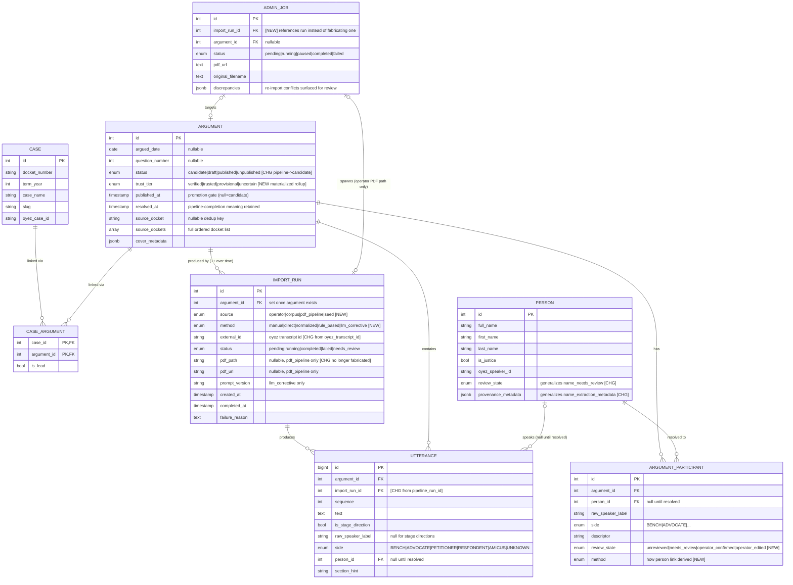

# Import Re-model — Entity Sketch

**Date:** 2026-08-13
**Status:** Draft sketch for review. Paper design only, no DDL. Names illustrative.
**Depends on:** `provenance-and-trust-model.md`, `import-architecture-diagnosis.md`
**Scope:** The import/provenance slice and its immediate neighbors. Tables outside
this slice (roles, court_tenures, speaker_alias, argument_status_log, case_appearances)
are unchanged and omitted for altitude.

---

## Lifecycle (the mental model, as data)

```
   import_run writes rows          operator reviews          operator promotes
        (candidate)          →        (checks out)        →      (published)
   Argument.status=candidate      review_state / tiers       published_at set
   trust_tier set on arrival      resolves needs_review       gate: no UNCERTAIN
```

An `Argument` is **born as a candidate** (`status=candidate`, not public) and
carries a `trust_tier` from the moment it exists. It becomes public only when an
operator promotes it (`published_at` set). The pre-published row *is* the holding
pen. "Candidate" is a status, not a separate table.

Legend for field notes: **[NEW]** field/table added, **[CHG]** changed from today,
**[RET]** retired, plain = unchanged.

---

## Diagram



---

## What changed and why (per the four decisions)

**IMPORT_RUN replaces PIPELINE_RUN (Q3).** The provenance/lineage backbone.
`source` + `method` replace the single overloaded `strategy` string. `pdf_path`/
`pdf_url` are now nullable and only populated for `pdf_pipeline` — the corpus path
stops fabricating them. Utterances FK here (`import_run_id`). `ADMIN_JOB` now
*references* an import_run rather than the corpus path inventing a fake job; the
corpus CLI batch needs no admin_job at all.

**ARGUMENT gains `trust_tier` (materialized, Q4) and a candidate status.**
`trust_tier` is the floor rollup of its utterances + participants, recomputed by a
single function on every mutation path (import, edit, review). `status=candidate`
is the born-not-public state; `published_at` is the promotion gate. Publish is
hard-blocked while any UNCERTAIN element remains, override logged (Q2).

**Provenance sits where values diverge.** ARGUMENT_PARTICIPANT and PERSON are the
operator-editable rows, so they carry their own `review_state` (four states, Q1) +
`method`. UTTERANCE inherits provenance from its IMPORT_RUN (no per-row provenance;
`strategy` column **[RET]**). This generalizes the existing `name_needs_review` /
`name_extraction_metadata` pattern instead of reinventing it.

## Deliberately unchanged

CASE, CASE_ARGUMENT, and the utterance/participant/person *shapes* are stable. The
read model and public site are untouched by this slice. `roles`, `court_tenures`,
`speaker_alias`, `argument_status_log`, `case_appearances` are outside the re-model.

## Open items carried forward

- Confirm `import_run` is per-argument (preserves Utterance FK) vs. adding a
  separate `import_batch` grouping for corpus term-range runs. Leaning per-argument
  now, batch as a later optional grouping.
- Whether `status=candidate` reuses the existing `argument_status` PG enum (add a
  value) or is a rename of `pipeline`. Enum values can't be dropped in PG, so likely
  add `candidate` and stop using `pipeline`.
- Exact `method` vocabulary on ARGUMENT_PARTICIPANT for the person-link derivation.
