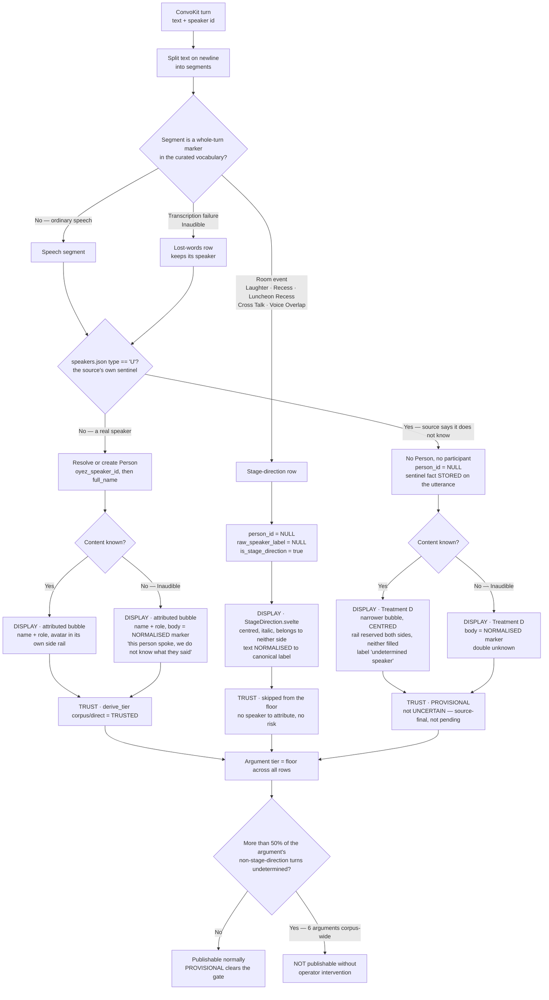

# Transcript Rendering — Scenario Inventory & Decision Tree

**Status:** consolidated record of operator decisions made 2026-09-23. Companion to
`undetermined-speaker-display.md`, which carries the measurements and the reasoning.
Not a plan.

Two orthogonal axes produce every case below:

- **Speaker** — do we know who spoke? (`speakers.json` `type` field)
- **Content** — do we know what they said? (the transcript's own marker vocabulary)

They were conflated for most of this investigation. Keeping them separate is what makes the
tree tractable.

## Decision tree

## Scenario inventory

| # | Scenario | Speaker | Content | Display | Tier contribution | Volume |
|---|---|---|---|---|---|---|
| 1 | Ordinary attributed speech | known | known | attributed bubble, own side rail | TRUSTED | ~1.59M turns |
| 2 | Undetermined speaker, words fine | **unknown** | known | **Treatment D** — centred, both rails empty, "undetermined speaker" | **PROVISIONAL** | ~69,000 turns |
| 3 | Consecutive undetermined turns | unknown ×2+ | known | same as 2 — **accepted as ambiguous, won't fix** | PROVISIONAL | 1.1% of 88,102 |
| 4 | Attributed, whole turn inaudible | known | **unknown** | attributed bubble, body = normalised marker | TRUSTED | **~13,221** |
| 5 | Undetermined **and** inaudible | **unknown** | **unknown** | Treatment D, body = normalised marker | PROVISIONAL | ~5,860 |
| 6 | Inline `(Inaudible)` mid-sentence | known | partial | verbatim inside the bubble — untouched | TRUSTED | ~30,800 |
| 7 | Laughter | n/a | n/a | stage direction, normalised | skipped | 1,020 |
| 8 | Voice Overlap | n/a | n/a | **stage direction** (operator, 2026-09-23), normalised | skipped | ~719 |
| 9 | Recess / Luncheon Recess / Cross Talk | n/a | n/a | stage direction, normalised | skipped | rare |
| 10 | Argument >50% undetermined | — | — | — | not publishable without intervention | **6 arguments** |

Row 6 is the one place the operator's *"whatever is in the utterance, is in the utterance"*
rule applies literally and nothing is normalised — the marker is inside a sentence a person
actually spoke, so touching it would be editing speech.

## Normalisation — what "normalised" means above

`pipeline/corpus/stage_directions.py::detect_stage_direction` **already returns a canonical
label** (`"Inaudible"`, `"Laughter"`, `"Voice Overlap"`, ...) with fuzzy matching at 0.8, which
is why real corpus typos like `(voive overlap)` and `(inaudioble)` are already caught. The
importer uses that return value **as a boolean only** and stores the raw segment text;
`StageDirection.svelte` then renders `{utterance.text}` verbatim.

So the canonical label exists today and is discarded one line later. Normalising is a matter of
keeping it, not building it.

The source is genuinely inconsistent — **31 distinct verbatim forms**, led by `(Inaudible)`
14,995, `[Inaudible]` 3,911, `(Voice Overlap)` 672, `(Inaudible).` 95, `[inaudible]` 39, plus
`( Voice Overlap)` and `(Inaudible.)`. Rendered raw, round and square brackets alternate
between adjacent turns.

**Operator decision 2026-09-23: normalise, "or it will look like a bug."**

**CONFIRMED by the operator 2026-09-23:** normalisation applies to **every whole-turn marker in
the curated vocabulary, wherever it is displayed** — stage-direction rows and lost-words bubble
bodies alike. **Row 6, the inline case, is explicitly excluded**: that marker sits inside a
sentence a person actually spoke, and rewriting it would edit speech.

## Rules that must not regress

- **Laughter inside a speaker's turn still splits.** Warren's `"It's on now.\n(Laughter)"`
  becomes his speech plus a separate room-event row. Easy to break by reaching for a simpler
  "stop splitting parentheticals" fix.
- **`(a)`, `(b)`, `(ph)` are never stage directions** — legal list markers and the
  phonetic-spelling convention. `_REJECTED_LITERALS` guards this deliberately.
- **The importer never creates a Person for a `type: "U"` speaker.** An earlier version did,
  producing a bogus `<INAUDIBLE>` advocate.
- **Trust never reaches a public surface.** PROVISIONAL is operator-facing only; reader-facing
  honesty is Treatment D's explanation card.

## Why the 50% line is the right one — resolved 2026-09-23

**Denominator: settled by measurement, not judgment.** All-turns and excluding-room-events give
the **identical 6 arguments**. Room-event rows average 0.17 per conversation corpus-wide (1,291
rows across 7,817 conversations), far too rare to move any ratio. Either denominator is fine.

**An earlier claim in this note's companion was wrong and is corrected here.** It said the
boundary "discriminates rather than rounds" because the next arguments sit at 49.8% and 49.6%.
There is no gap — roughly **256 arguments sit between 45% and 50%**, densely packed. That
reasoning was drawn from looking at two neighbours.

**The boundary is principled for a structural reason instead.** The bench speaks roughly half
the turns in any argument, so:

| conv | undetermined | justice turns | advocate turns | share |
|---|---|---|---|---|
| 16897 | 100 | 23 | 24 | 68.0% |
| 19600 | 124 | 5 | 84 | 58.2% |
| 16762 | 134 | **2** | 131 | 50.2% |
| 18111 | 121 | **1** | 121 | 49.8% |
| 21839 | 69 | **1** | 69 | 49.6% |

The cluster just below 50% is **"the whole bench is anonymous, advocates intact"** — one or two
attributed justice turns out of ~120 bench turns. Undetermined turns can only *exceed* 50% once
advocates are anonymous too.

So the rule reads: **publish if a reader can at least tell who the advocates are.** That is why
50% catches 6 arguments and 45% would catch ~256.

## Still open

1. **Unverified in a browser:** `ChatBubble.svelte:49` falls back to `raw_speaker_label`, which
   is believed to render a literal `<INAUDIBLE>` today. Treatment D replaces it, but nobody has
   seen the current behaviour on screen.
